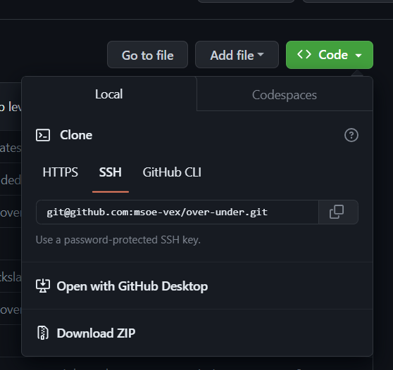

# Raider Robotics Over Under Project
<!-- add a CI status here when we have that -->

PROS workspace for the 2023-2024 VEX U game Over Under.

### :bangbang: This project is under construction and currently has many errors. This README is a good starting point but refer to the `SpinUp-ros2` repo for our fully functioning code from last year. :bangbang:

## Recommend Tools
[Visual Studio Code](https://code.visualstudio.com/)

### Git Tools:
We use Git to organize our software development. There are two main ways to interact with Git. There is the [Command Line Interface (CLI)](https://git-scm.com/downloads) that has you using commands in shell. There are also a few different GUI applications that can be used to interact with Git. My personal favorites are [GitHub Desktop](https://desktop.github.com/) and [Sublime Merge](https://www.sublimemerge.com/). GitHub Desktop is a little more user friendly but Sublime Merge has a better branch visualizer. I personally user GitHub Desktop most of the time.

## Cloning the Repository
<!-- To build this project with Docker Desktop, autocrlf must be set to false in Git **before cloning**. This can be done with the following command:

`git config --global core.autocrlf false` -->
You can clone the resposity using the built in funtionality in most Git GUI applications once you login with your GitHub account. If you choose to do it using the command line, you can do it through HTTPS or SSH. Either will work just fine but I reccomend setting up SSH at some point in your GitHub account as it is more secure and professional. 

If you are using the command line, run the below command in the folder that you want the the `over-under` project folder to exist INSIDE OF. In other words, don't make an `over-under` folder and run the command inside of that, you will have two layers of `over-under`. You should create a folder to hold repositories in and run the below command in there. Command to run: `git clone` followed by the path copies from the repo's green Code button like the image below. If you are using SSH, it should look like: `git clone git@github.com:msoe-vex/over-under.git`

## Development Environment Options
There are two main options for development environments:

### Option 1: Install only the required extentions in VSCode
This option is definitely the more lightweight option. All you have to do is install a few VSCode extensions that will give you basic C++ usage, compilation, and the ability to upload to the robot. This is NOT a full C++ development environment, which is not required to work with the project. If you are not familiar with VSCode or extensions read some of [this](https://code.visualstudio.com/docs/editor/extension-marketplace).

#### 1. Install the C/C++ Extension Pack
C++ intellisense, code completion, and basic linking through Cmake.

#### 2. Install the PROS extension
[PROS](https://pros.cs.purdue.edu/) is the library that we use to communicate with our robot. It is an open-source project updated and maintained by students and faculty from Purdue University. This extention gives us easy access to the PROS CLI commands through the PROS Terminal. PROS compiles and uploads our code for us which is why we don't need a full C++ development environment.

### Option 2: Docker Containers through VSCode's Dev Containers
This option utilizes VSCode's Dev Containers extension to open the project within a Linux Docker Container that has a full C++ development environment as well as all required and reccomended extentions. This option also containerizes this development environment so that it doesn't mess with anything else on your computer. This is the more complicated of the two options as a full C++ development environment is not required.

#### **The rest of this section is under construction, only use this option if you know what you are doing.**

## Using PROS
**From Dev environmet Option 1:** Clicking on the PROS icon in the extentions list will bring up a list of different commands to click on where the file system would normally be. Almost everything in PROS is available here but I reccomend clicking on the `Integrated Terminal` option to bring up the PROS Terminal which gives you access to the PROS CLI inside of this terminal.

**From Dev Environment Option 2:** Opening a terminal in VSCode should gain you access to the PROS CLI.

**Once you get access to the PROS CLI:** There are two main comands to know. `pros make` or `pros build` will compile all of the C++ code in the current PROS Project. If there are any comile errors, they will show up in this terminal after running one of those commands. `pros upload` will upload the code to the currently connected VEX Brain or Controller. Brains or Controllers should be connected to laptops with a USB cable. 

## Troubleshooting
### PROS
If you have any issues with PROS, especially if you are getting error messages about the PROS Toolchain. Restarting your computer works more often than it should. You can also try uninstalling PROS from the Exention and doing the same with the extension yourself. If you are still having issues or are having other issues, constact a veteran member.

### C++
If you are having issues with C++, start by referring to the C++ Guide in the top level of this project. If the answers aren't there, Google is always your friend as a software engineer. If you are still stumped, contact a veteran member.

### Include Errors
If you are getting lots of include errors or your intellisense and/or code completion is not really working, ensure that you have a `c_cpp_properties.json` file in your .vscode folder. If you do not, ensure you have all the required extensions installed as listed in the README. If you do, close and reopen VSCode. The PROS extension should generate that file for you and point the C++ extension to the C++ compiler that comes bundled with the PROS extension.
